# Unreal Mesh Render Pipeline Analysis


## Unreal Engine Mesh Draw Pipeline
[原文链接](https://zhuanlan.zhihu.com/p/574116410) [图片链接](https://pic1.zhimg.com/70/v2-1c622885971aef9b6c4a3ee1a6fca6f4_1440w.avis?source=172ae18b&biz_tag=Post)
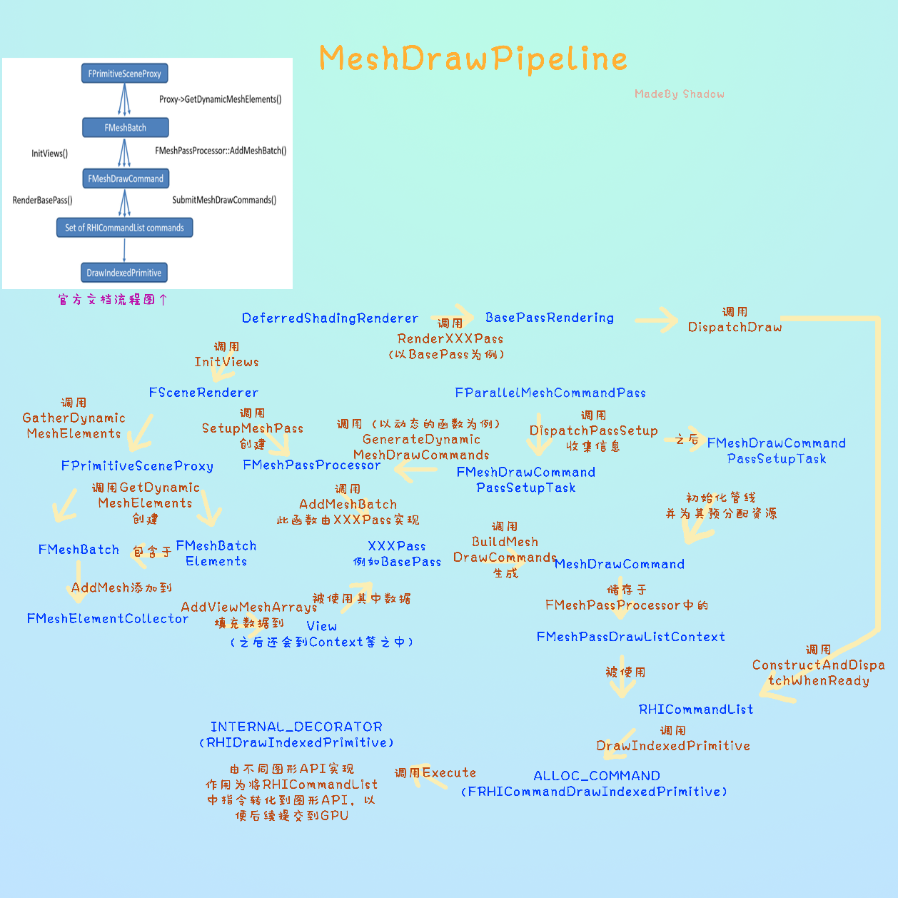
[网格处理的类与方法](UERenderPipeline.html)
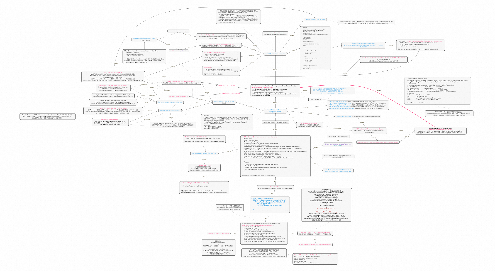


## Render Path Overview
### Entry Overview
Unreal Engine 5.2 中的渲染绘制的入口在 `FViewPort::Draw()`，调用堆栈如下图所示，`Draw()`函数由引擎的更新函数`Tick()`每帧调用。
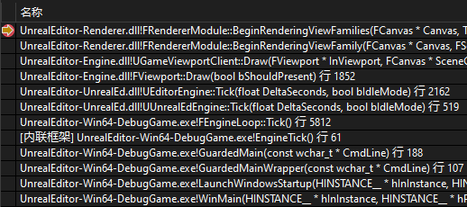

`Draw()`中会调用`FRendererModule::BeginRenderingViewFamily`(`FRendererModule::BeginRenderingViewFamilies`)，向渲染线程发送消息以开始渲染流程。
```cpp
// Engine\Source\Runtime\Engine\Private\GameViewportClient.cpp
void UGameViewportClient::Draw(FViewport* InViewport, FCanvas* SceneCanvas)
{
...
	GetRendererModule().BeginRenderingViewFamily(SceneCanvas, &ViewFamily);
...
}
```
`FRendererModule::BeginRenderingViewFamilies`中会入队在渲染线程执行的命令`RenderViewFamilies_RenderThread`，该方法会调用`FDeferredShadingSceneRenderer::Render`或`FMobileSceneRenderer::Render`开启场景的绘制。
```cpp
// Engine\Source\Runtime\Renderer\Private\SceneRendering.cpp
void FRendererModule::BeginRenderingViewFamilies(FCanvas* Canvas, TArrayView<FSceneViewFamily*> ViewFamilies)
{
...
		ENQUEUE_RENDER_COMMAND(FDrawSceneCommand)(
			[LocalSceneRenderers = CopyTemp(SceneRenderers), DrawSceneEnqueue](FRHICommandListImmediate& RHICmdList)
			{
				uint64 SceneRenderStart = FPlatformTime::Cycles64();
				const float StartDelayMillisec = FPlatformTime::ToMilliseconds64(SceneRenderStart - DrawSceneEnqueue);
				CSV_CUSTOM_STAT_GLOBAL(DrawSceneCommand_StartDelay, StartDelayMillisec, ECsvCustomStatOp::Set);
				RenderViewFamilies_RenderThread(RHICmdList, LocalSceneRenderers);
				FlushPendingDeleteRHIResources_RenderThread();
			});
...
}

static void RenderViewFamilies_RenderThread(FRHICommandListImmediate& RHICmdList, const TArray<FSceneRenderer*>& SceneRenderers)
{
...
	// Render the scene.
	SceneRenderer->Render(GraphBuilder);
...
}

```
我们主要关注延迟渲染管线，`FDeferredShadingSceneRenderer::Render`中调用`FDeferredShadingSceneRenderer::BeginInitViews`开始初始化场景的视图、检查可见性、构建可视网格绘制命令等，调用`RenderXXXPass()`以开始不同Pass的渲染。

### Call Stack Analysis
下面我们从三个较为重要的 ***CallStack*** 入手进行分析


#### Call Stack1: Get MeshBatch
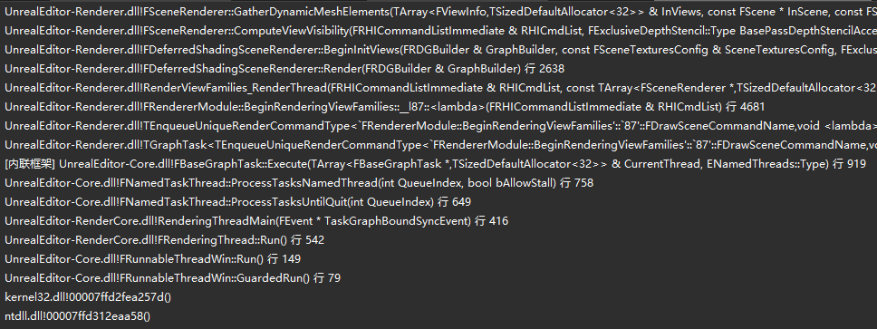
> ***CallStack1*** 是在渲染线程获取场景图元的网格信息的调用堆栈，这个堆栈从`BeginInitViews`开始，一直到底层收集`FMeshElement`的函数`GetDynamicMeshElements`，通过这个堆栈可以了解到场景图元的网格信息是如何收集、存储的，注意这个堆栈针对的是动态的场景图元`DynamicMesh`。

`FSceneRenderer::GatherDynamicMeshElements`在执行可见性检查`FSceneRenderer::ComputeViewVisibility`时被调用，其中的`FPrimitiveSceneProxy::GetDynamicMeshElements`是给每个图元对象向渲染器（收集器）添加可见图元元素的机会，由具体的子类实现，如`FLineBatcherSceneProxy`, `FStaticMeshSceneProxy`,`FSkeletalMeshSceneProxy`等。
`Engine\Source\Runtime\Renderer\Private\SceneVisibility.cpp`
```cpp
void FSceneRenderer::GatherDynamicMeshElements(
	TArray<FViewInfo>& InViews, 
	const FScene* InScene, 
	const FSceneViewFamily& InViewFamily, 
	FGlobalDynamicIndexBuffer& DynamicIndexBuffer,
	FGlobalDynamicVertexBuffer& DynamicVertexBuffer,
	FGlobalDynamicReadBuffer& DynamicReadBuffer,
	const FPrimitiveViewMasks& HasDynamicMeshElementsMasks, 
	const FPrimitiveViewMasks& HasDynamicEditorMeshElementsMasks,
	FMeshElementCollector& Collector)
{
	...
	for (int32 PrimitiveIndex = 0; PrimitiveIndex < NumPrimitives; ++PrimitiveIndex)
		{
			const uint8 ViewMask = HasDynamicMeshElementsMasks[PrimitiveIndex];

			if (ViewMask != 0)
			{
				...
				Collector.SetPrimitive(PrimitiveSceneInfo->Proxy, PrimitiveSceneInfo->DefaultDynamicHitProxyId);

				PrimitiveSceneInfo->Proxy->GetDynamicMeshElements(InViewFamily.Views, InViewFamily, ViewMaskFinal, Collector);
				...
			}

	}
	...
}
```
以`FStaticMeshSceneProxy`为例，会根据不同的LOD索引，为每个Section网格添加一个`FMeshBatch`，然后将`FMeshBatch`加入到`FMeshElementCollector`
`Engine\Source\Runtime\Engine\Private\StaticMeshRender.cpp`
```cpp
void FStaticMeshSceneProxy::GetDynamicMeshElements(const TArray<const FSceneView*>& Views, const FSceneViewFamily& ViewFamily, uint32 VisibilityMap, FMeshElementCollector& Collector) const
{
...
for (int32 BatchIndex = 0; BatchIndex < NumBatches; BatchIndex++)
{
    // GetWireframeMeshElement will try SetIndexSource at section index 0
    // and GetMeshElement loops over sections, therefore does not have this issue
    if (LODModel.Sections.Num() > 0)
    {
        FMeshBatch &Mesh = Collector.AllocateMesh();

		...
		Collector.AddMesh(ViewIndex, MeshElement);
		...
    
	}
}
...
}
```


#### Call Stack2: Build MeshDrawCommand
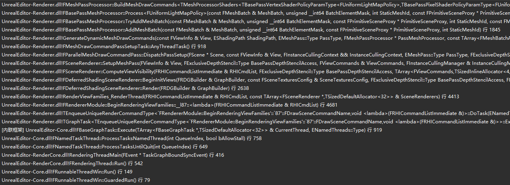
> ***CallStack2*** 则是在渲染线程构建网格绘制命令的调用堆栈，这个堆栈以`FSceneRenderer::SetupMeshPass`为入口，逐个Pass地进行`DispatchPassSetup`来构建该Pass中所需要绘制的`MeshDrawCommand`，通过`AddMeshBatch`逐个地将`FMeshBatch`转换成对应的`MeshDrawCommand`。

`FSceneRenderer::ComputeViewVisibility`中除了`FSceneRenderer::GatherDynamicMeshElements`外还有一个关键的函数`FSceneRenderer::SetupMeshPass`，这个函数会遍历所有Pass的类型，创建对应的`FMeshPassProcessor`，再调用`FParallelMeshDrawCommandPass::DispatchPassSetup`开始该Pass的创建与MeshDrawCommand的构建。
```cpp
// Engine\Source\Runtime\Renderer\Private\SceneRendering.cpp
void FSceneRenderer::SetupMeshPass(FViewInfo& View, FExclusiveDepthStencil::Type BasePassDepthStencilAccess, FViewCommands& ViewCommands, FInstanceCullingManager& InstanceCullingManager)
{
...
			FMeshPassProcessor* MeshPassProcessor = FPassProcessorManager::CreateMeshPassProcessor(ShadingPath, PassType, Scene->GetFeatureLevel(), Scene, &View, nullptr);

			FParallelMeshDrawCommandPass& Pass = View.ParallelMeshDrawCommandPasses[PassIndex];
...
			Pass.DispatchPassSetup(
				Scene,
				View,
				FInstanceCullingContext(FeatureLevel, &InstanceCullingManager, ViewIds, View.PrevViewInfo.HZB, InstanceCullingMode, CullingFlags),
				PassType,
				BasePassDepthStencilAccess,
				MeshPassProcessor,
				View.DynamicMeshElements,
				&View.DynamicMeshElementsPassRelevance,
				View.NumVisibleDynamicMeshElements[PassType],
				ViewCommands.DynamicMeshCommandBuildRequests[PassType],
				ViewCommands.NumDynamicMeshCommandBuildRequestElements[PassType],
				ViewCommands.MeshCommands[PassIndex]);
...
}
```


`FParallelMeshDrawCommandPass::DispatchPassSetup`中先收集Pass相关的信息到TaskContext中，再调用`FMeshDrawCommandPassSetupTask::AnyThreadTask`创建任务和`FMeshDrawCommandInitResourcesTask::AnyThreadTask`初始化资源。
```cpp
// Engine\Source\Runtime\Renderer\Private\MeshDrawCommands.cpp
void FParallelMeshDrawCommandPass::DispatchPassSetup(
	FScene* Scene,
	const FViewInfo& View,
	FInstanceCullingContext&& InstanceCullingContext,
	EMeshPass::Type PassType,
	FExclusiveDepthStencil::Type BasePassDepthStencilAccess,
	FMeshPassProcessor* MeshPassProcessor,
	const TArray<FMeshBatchAndRelevance, SceneRenderingAllocator>& DynamicMeshElements,
	const TArray<FMeshPassMask, SceneRenderingAllocator>* DynamicMeshElementsPassRelevance,
	int32 NumDynamicMeshElements,
	TArray<const FStaticMeshBatch*, SceneRenderingAllocator>& InOutDynamicMeshCommandBuildRequests,
	int32 NumDynamicMeshCommandBuildRequestElements,
	FMeshCommandOneFrameArray& InOutMeshDrawCommands,
	FMeshPassProcessor* MobileBasePassCSMMeshPassProcessor,
	FMeshCommandOneFrameArray* InOutMobileBasePassCSMMeshDrawCommands
)
{
...
	if (bExecuteInParallel)
		{
			if (IsOnDemandShaderCreationEnabled())
			{
				TaskEventRef = TGraphTask<FMeshDrawCommandPassSetupTask>::CreateTask(nullptr, ENamedThreads::GetRenderThread()).ConstructAndDispatchWhenReady(TaskContext);
			}
			else
			{
				FGraphEventArray DependentGraphEvents;
				DependentGraphEvents.Add(TGraphTask<FMeshDrawCommandPassSetupTask>::CreateTask(nullptr, ENamedThreads::GetRenderThread()).ConstructAndDispatchWhenReady(TaskContext));
				TaskEventRef = TGraphTask<FMeshDrawCommandInitResourcesTask>::CreateTask(&DependentGraphEvents, ENamedThreads::GetRenderThread()).ConstructAndDispatchWhenReady(TaskContext);
			}
		}
		else
		{
			QUICK_SCOPE_CYCLE_COUNTER(STAT_MeshPassSetupImmediate);
			FMeshDrawCommandPassSetupTask Task(TaskContext);
			Task.AnyThreadTask();
			if (!IsOnDemandShaderCreationEnabled())
			{
				FMeshDrawCommandInitResourcesTask DependentTask(TaskContext);
				DependentTask.AnyThreadTask();
			}
		}
...
}
```


`GenerateDynamicMeshDrawCommands`将会转换指定`EMeshPass`中的每个`FMeshBatch`到一组`FMeshDrawCommand`，其中既会处理动态网格批次`DynamicMeshBatches`也会处理静态网格批次`StaticMeshBatches`，`DynamicMeshCommandBuildRequests`的数量即`NumDynamicMeshCommandBuildRequestElements`，代表`StaticMeshBatches`的数量。
`AddMeshBatch`为开始将该`FMeshBatch`转换成`FMeshDrawCommand`的入口。
```cpp
// Engine\Source\Runtime\Renderer\Private\MeshDrawCommands.cpp
void GenerateDynamicMeshDrawCommands(
	const FViewInfo& View,
	EShadingPath ShadingPath,
	EMeshPass::Type PassType,
	FMeshPassProcessor* PassMeshProcessor,
	const TArray<FMeshBatchAndRelevance, SceneRenderingAllocator>& DynamicMeshElements,
	const TArray<FMeshPassMask, SceneRenderingAllocator>* DynamicMeshElementsPassRelevance,
	int32 MaxNumDynamicMeshElements,
	const TArray<const FStaticMeshBatch*, SceneRenderingAllocator>& DynamicMeshCommandBuildRequests,
	int32 MaxNumBuildRequestElements,
	FMeshCommandOneFrameArray& VisibleCommands,
	FDynamicMeshDrawCommandStorage& MeshDrawCommandStorage,
	FGraphicsMinimalPipelineStateSet& MinimalPipelineStatePassSet,
	bool& NeedsShaderInitialisation
)
{
	...
	{
		const int32 NumCommandsBefore = VisibleCommands.Num();
		const int32 NumDynamicMeshBatches = DynamicMeshElements.Num();

		for (int32 MeshIndex = 0; MeshIndex < NumDynamicMeshBatches; MeshIndex++)
		{
			if (!DynamicMeshElementsPassRelevance || (*DynamicMeshElementsPassRelevance)[MeshIndex].Get(PassType))
			{
				const FMeshBatchAndRelevance& MeshAndRelevance = DynamicMeshElements[MeshIndex];
				const uint64 BatchElementMask = ~0ull;

				PassMeshProcessor->AddMeshBatch(*MeshAndRelevance.Mesh, BatchElementMask, MeshAndRelevance.PrimitiveSceneProxy);
			}
		}

		const int32 NumCommandsGenerated = VisibleCommands.Num() - NumCommandsBefore;
		checkf(NumCommandsGenerated <= MaxNumDynamicMeshElements,
			TEXT("Generated %d mesh draw commands for DynamicMeshElements, while preallocating resources only for %d of them."), NumCommandsGenerated, MaxNumDynamicMeshElements);
	}
	...
	{
		const int32 NumCommandsBefore = VisibleCommands.Num();
		const int32 NumStaticMeshBatches = DynamicMeshCommandBuildRequests.Num();

		for (int32 MeshIndex = 0; MeshIndex < NumStaticMeshBatches; MeshIndex++)
		{
			const FStaticMeshBatch* StaticMeshBatch = DynamicMeshCommandBuildRequests[MeshIndex];
			const uint64 DefaultBatchElementMask = ~0ul;
			PassMeshProcessor->AddMeshBatch(*StaticMeshBatch, DefaultBatchElementMask, StaticMeshBatch->PrimitiveSceneInfo->Proxy, StaticMeshBatch->Id);
		}

		const int32 NumCommandsGenerated = VisibleCommands.Num() - NumCommandsBefore;
		checkf(NumCommandsGenerated <= MaxNumBuildRequestElements,
			TEXT("Generated %d mesh draw commands for DynamicMeshCommandBuildRequests, while preallocating resources only for %d of them."), NumCommandsGenerated, MaxNumBuildRequestElements);
	}
	...
}
```

`FMeshPassProcessor::BuildMeshDrawCommands`中会创建`FMeshDrawCommand`并填充信息，然后将其添加到`DrawListContext`中，最后再执行`FinalizeCommand`完成MeshDrawCommands的构建。

以`FDynamicPassMeshDrawListContext`为例，`FDynamicPassMeshDrawListContext::FinalizeCommand`中使用传入的`FMeshDrawCommand`创建`FVisibleMeshDrawCommand`并添加到`FMeshProcessor`的`DrawList`中， `DrawList`的类型是`FMeshCommandOneFrameArray`，`FMeshCommandOneFrameArray`的定义为： `typedef TArray<FVisibleMeshDrawCommand, SceneRenderingAllocator> FMeshCommandOneFrameArray;`。`FVisibleMeshDrawCommand`主要用于`View`之间的信息传递，其中有指向对应的`FMeshDrawCommand`的指针，绘制所需要的信息储存且仅存储在`FMeshDrawCommand`中。
```cpp
// Engine\Source\Runtime\Renderer\Public\MeshPassProcessor.h
	virtual void FinalizeCommand(
		const FMeshBatch& MeshBatch, 
		int32 BatchElementIndex,
		const FMeshDrawCommandPrimitiveIdInfo &IdInfo,
		ERasterizerFillMode MeshFillMode,
		ERasterizerCullMode MeshCullMode,
		FMeshDrawCommandSortKey SortKey,
		EFVisibleMeshDrawCommandFlags Flags,
		const FGraphicsMinimalPipelineStateInitializer& PipelineState,
		const FMeshProcessorShaders* ShadersForDebugging,
		FMeshDrawCommand& MeshDrawCommand) override final
	{
		FGraphicsMinimalPipelineStateId PipelineId = FGraphicsMinimalPipelineStateId::GetPipelineStateId(PipelineState, GraphicsMinimalPipelineStateSet, NeedsShaderInitialisation);

		MeshDrawCommand.SetDrawParametersAndFinalize(MeshBatch, BatchElementIndex, PipelineId, ShadersForDebugging);

		FVisibleMeshDrawCommand NewVisibleMeshDrawCommand;
		//@todo MeshCommandPipeline - assign usable state ID for dynamic path draws
		// Currently dynamic path draws will not get dynamic instancing, but they will be roughly sorted by state
		const FMeshBatchElement& MeshBatchElement = MeshBatch.Elements[BatchElementIndex];
		NewVisibleMeshDrawCommand.Setup(&MeshDrawCommand, IdInfo, -1, MeshFillMode, MeshCullMode, Flags, SortKey,
			MeshBatchElement.bIsInstanceRuns ? MeshBatchElement.InstanceRuns : nullptr,
			MeshBatchElement.bIsInstanceRuns ? MeshBatchElement.NumInstances : 0
			);
		DrawList.Add(NewVisibleMeshDrawCommand);
	}
```


#### Call Stack3: Submit RHICommand
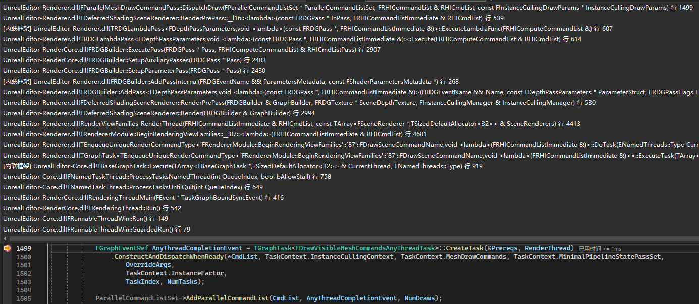
> ***CallStack3*** 是不同的Pass执行绘制命令的调用堆栈，基本的方式是将绘制命令`DispatchDraw`以Lambda形式传递给RDG，由RDG决定Pass的资源分配与依赖后再执行绘制。

在可见性测试后便是渲染的环节，`FDeferredShadingSceneRenderer`为不同的pass实现了不同的渲染函数并命名为`RenderXXXPass`(XXX:Pass Name)，执行绘制的入口是该pass对应的`ParallelMeshDrawCommandPasses`的`DispatchDraw`方法，以prePass为例，在`RenderPrePass`函数中，绘制的入口以及pass参数先被加入RDG进行资源的处理，再异步地（由RDG决定顺序）以Lambda函数方式被调用。

```cpp
// DepthRendering.cpp
void FDeferredShadingSceneRenderer::RenderPrePass(FRDGBuilder& GraphBuilder, FRDGTextureRef SceneDepthTexture, FInstanceCullingManager& InstanceCullingManager)
{
...
					GraphBuilder.AddPass(
						RDG_EVENT_NAME("DepthPassParallel"),
						PassParameters,
						ERDGPassFlags::Raster | ERDGPassFlags::SkipRenderPass,
						[this, &View, PassParameters](const FRDGPass* InPass, FRHICommandListImmediate& RHICmdList)
					{
						FRDGParallelCommandListSet ParallelCommandListSet(InPass, RHICmdList, GET_STATID(STAT_CLP_Prepass), *this, View, FParallelCommandListBindings(PassParameters));
						ParallelCommandListSet.SetHighPriority();

						View.ParallelMeshDrawCommandPasses[EMeshPass::DepthPass].DispatchDraw(&ParallelCommandListSet, RHICmdList, &PassParameters->InstanceCullingDrawParams);
					});
...
}
```

`FDrawVisibleMeshCommandAnyThreadTask`执行的绘制指令单个MeshDrawCommand的绘制命令的创建的调用堆栈如下，绘制的任务并不是立即执行的，而是由RDG的`Execute()`发起执行。
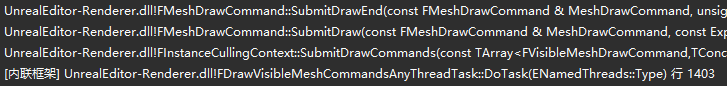
```cpp
// MeshPassProcessor.cpp
void FMeshDrawCommand::SubmitDrawEnd(const FMeshDrawCommand& MeshDrawCommand, uint32 InstanceFactor, FRHICommandList& RHICmdList,
	FRHIBuffer* IndirectArgsOverrideBuffer,
	uint32 IndirectArgsOverrideByteOffset)
{
    RHICmdList.DrawIndexedPrimitive(
				MeshDrawCommand.IndexBuffer,
				MeshDrawCommand.VertexParams.BaseVertexIndex,
				0,
				MeshDrawCommand.VertexParams.NumVertices,
				MeshDrawCommand.FirstIndex,
				MeshDrawCommand.NumPrimitives,
				MeshDrawCommand.NumInstances * InstanceFactor
			);
}
```

`DrawIndexedPrimitive`在ByPass情况下会直接调用的方法`RHIDrawIndexedPrimitive`由不同图形驱动的RHI实现，实测在windows下只有在FD3D12对应的RHI中打断点才会生效，并没有使用到其他图形驱动的RHI。
`RHICommandList.h`
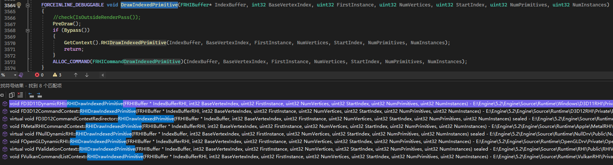

以OpenGL为例，该方法会直接调用OpenGL的绘制方法如`glDrawElementsInstanced`和`glDrawElements`等进行绘制。
```cpp
// OpenGLCommands.cpp
void FOpenGLDynamicRHI::RHIDrawIndexedPrimitive(FRHIBuffer* IndexBufferRHI, int32 BaseVertexIndex, uint32 FirstInstance, uint32 NumVertices, uint32 StartIndex, uint32 NumPrimitives, uint32 NumInstances)
{
    ...
    FOpenGL::DrawElementsInstanced(DrawMode, NumElements, IndexType, INDEX_TO_VOID(StartIndex), NumInstances);
    /*
    OpenGL3.h
    static FORCEINLINE void DrawElementsInstanced(GLenum Mode, GLsizei Count, GLenum Type, const GLvoid* Indices, GLsizei InstanceCount)
	{
		glDrawElementsInstanced(Mode, Count, Type, Indices, InstanceCount);
	}
    */
    ...
    glDrawElements(DrawMode, NumElements, IndexType, INDEX_TO_VOID(StartIndex));
    ...
}
```

---

## Example: PrePass (Depth Pass)

### Scene Overview
1 Cube + 1 DirectionalLight
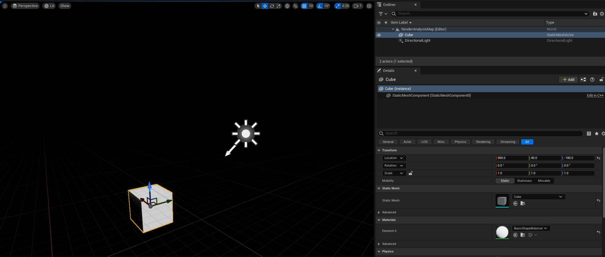

### CVars (Console Variables) at Engine\Config\ConsoleVariables.ini
虚幻的绘制数据分两类，一类是Dynamic一类是Static，不同的绘制数据的绘制路径是不一样的。Static数据是预生成的，将被保存在CachedMeshDrawCommandStateBuckets里，Dynamic的MeshDrawCommand是每帧重新生成的。按照下图设置cvars以后每帧都会重新生成MeshDrawCommand，方便分析。绘制时默认采用ParallelCmdList进行，按照下图设置cvars后方便跟踪堆栈调用。
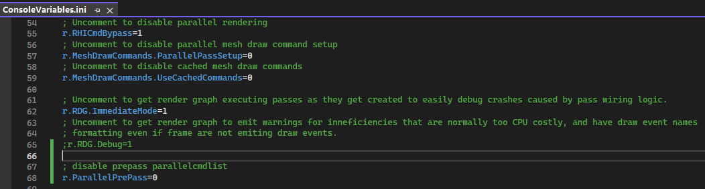

### Cube相关信息截帧

#### 几何信息
在编辑器界面查看Cube的几何信息如下，其中有一个LOD0、48Triangles和54Vertices等。
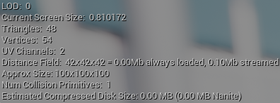

#### 场景信息
游戏线程在`FRendererModule::BeginRenderingViewFamily`中初始化渲染线程的场景渲染器`FSceneRenderer`，然后在渲染线程执行的方法`RenderViewFamilies_RenderThread`中调用`FSceneRenderer`的`Render()`方法进行渲染。

在渲染线程遍历`SceneRenders`执行实际的渲染函数`Render()`前打断点截帧，查看`Scene`里的`Primitives`信息，`Primitives`里的元素实际上是`FPrimitiveSceneInfo`。
`SceneRendering.cpp`
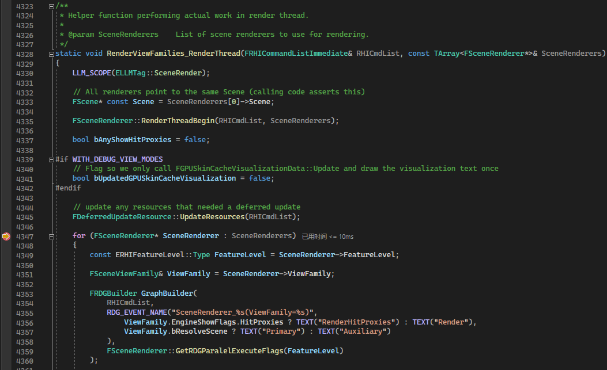

场景中共有五个`Primitives`。


从`Primitives`的`Proxy`的`ResourceName`和`OwnerName`中可以看出第一个primitive对应的是Cube，第二个是Sphere代表的DefaultPawn，剩下三个是LineBatchComponent。
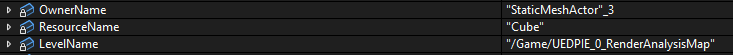
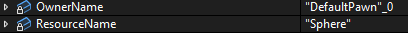

#### 静态绘制路径，缓存MeshBatch
静态绘制路径通常可以被缓存，所以也叫缓存绘制路径，适用的对象可以是静态模型（可在UE编辑器的网格属性面板中指定，见下图）。
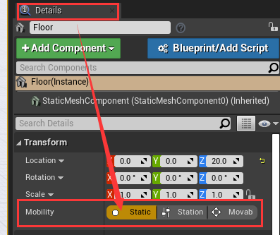
静态模型在加入场景后，其对应的`FPrimitiveSceneInfo`在调用`AddStaticMeshes`时，被执行缓存处理，调用堆栈如下所示。`AddStaticMeshes`中会添加静态网格元素到场景的静态网格列表，也会缓存静态的MeshDrawCommand（如果开启了缓存）。

我们添加且只添加一个静态的Cube到场景。打断点可以发现在执行完`AddStaticMeshes`后，场景中的`StaticMeshes`已经有了4个元素，其中第0个和第1个就是我们添加的Cube的`FStaticMeshBatch`，他们的`PrimitiveSceneInfo`是一样的。
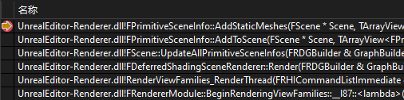
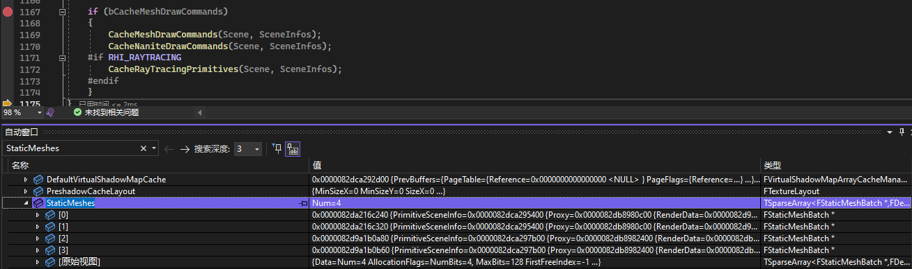

#### 可视性与相关性检测
`SceneVisibility.cpp`里的`FsceneRender::ComputeViewVisibility`中执行各种剔除与可视性检测，然后在`FSceneRenderer::SetupMeshPass`中遍历各个pass生成drawcommand。在构建最后的绘制列表之前需要把不需要的MeshDrawCommand剔除掉，UE有多种剔除算法，可见性剔除，视锥体剔除等。最后会构建一个View.PrimitiveVisibilityMap。这个VisibilityMap会把没用的MeshDrawCommand丢掉，让它无法进入最后的渲染队列里。
在进行剔除与可视性检测后的VisibilityMap中可以看到，Cube的可见性标志位为1（可见），Pawn的Sphere的可见性标志位为0（不可见）。
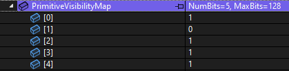

在`FsceneRender::ComputeViewVisibility`中还会进行相关性(`Relevance`)的检测，我们加入场景的`Cube`是静态物体，场景中已经缓存了它的`MeshBatch`，但是由于没有缓存它的`MeshDrawCommand`所以每帧都要重新生成这个静态`MeshBatch`的`MeshDrawCommand`。

在`ComputeAndMarkRelevanceForViewParallel`中会计算相关性并且填充`FViewCommands`中的`NumDynamicMeshCommandBuildRequestElements`等信息，这个对应的就是需要构建`MeshDrawCommand`的静态`FMeshBatch`的数量，如下图断点所示，在经过相关性计算后，第一个Pass和第二个Pass对应的`NumDynamicMeshCommandBuildRequestElements`被填充为1，代表该Pass中有一个静态物体生成的`FMeshBatch`需要构建成`MeshDrawCommand`。
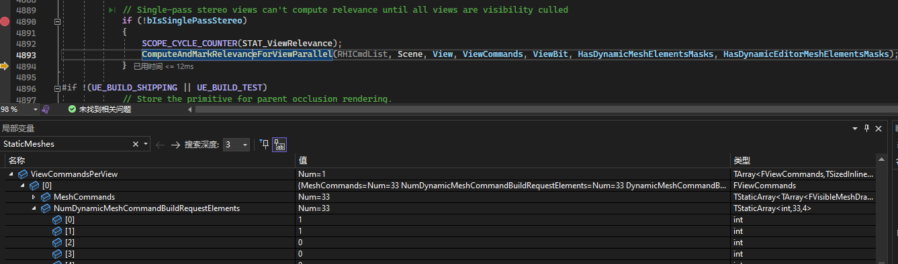

#### 设置MeshPass与构建MeshDrawCommand
在`FSceneRenderer::SetupMeshPass`中打断点调试可以看到`ParallelMeshDrawCommandPasses`中的各个Pass的信息被逐个填充，其成员变量`TaskContext`里有该Pass对应的MeshDrawCommand信息。
`SceneRendering.cpp` 
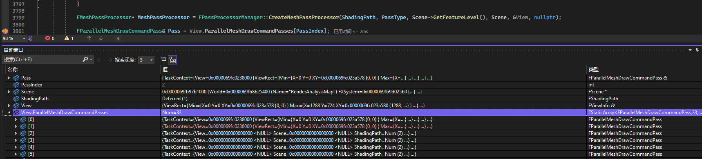

在`GenerateDynamicMeshDrawCommands`中打断点截帧可以发现，在`PrePass`构建过程中，没有`DynamicMeshBatch`，有且只有一个`StaticMeshBatch`，而且根据其`PrimitiveSceneInfo`可以确定这个`MeshBatch`对应的是Cube。
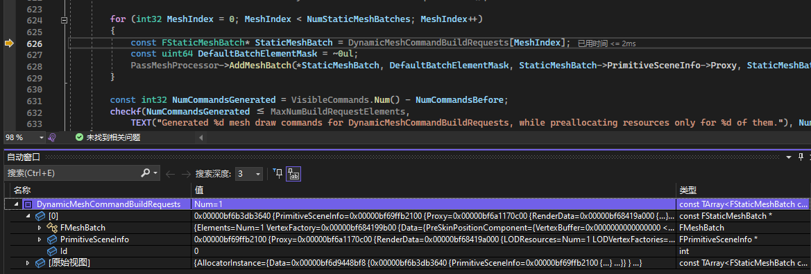

`FDepthMeshProcessor::AddMeshBatch`会继续调用直到`BuildMeshDrawCommand`，打断点截帧进行分析，此时的堆栈如下，可以看到堆栈走的是DepthPass的路径。
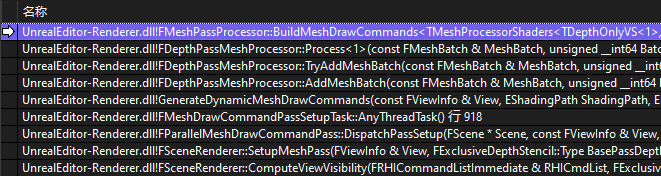

`BuildMeshDrawCommand`中创建了`FMeshDrawCommand`并将其添加到`DrawListStorage`，如下图断点所示，在执行`AddCommand`之前，此时的`DrawListStorage`是空的。
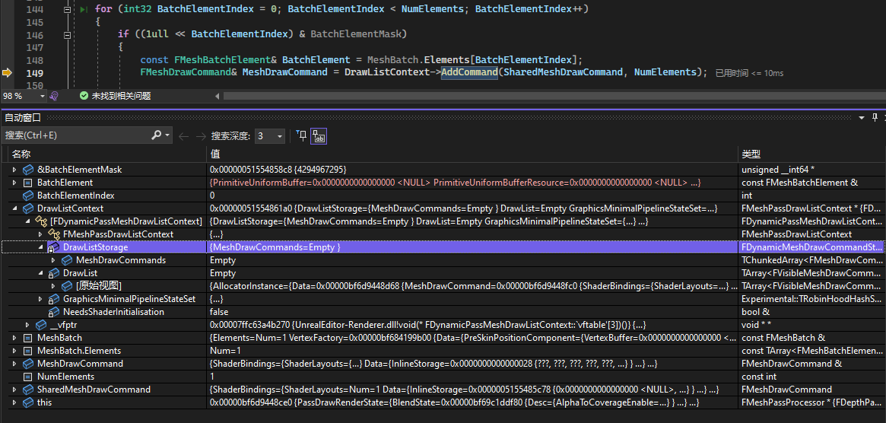

在执行完`AddCommand`和`FinalizeCommand`之后，DepthPass的`MeshProcessor`中就有了Cube对应的`FMeshBatch`所生成的`FMeshDrawCommand`的信息。最终生成的`FMeshDrawCommand`的信息主要有着色器绑定(ShaderBindings)、顶点流(VertexStreams)、索引缓冲(IndexBuffer)、PSO(CachedPipelineId)、绘制参数(FirstIndex、NumPrimitive、NumInstances)等。`FDepthPassMeshProcessor`最后共生成了一个`FMeshDrawCommand`，其中的信息可以和Cube的几何信息相对应。
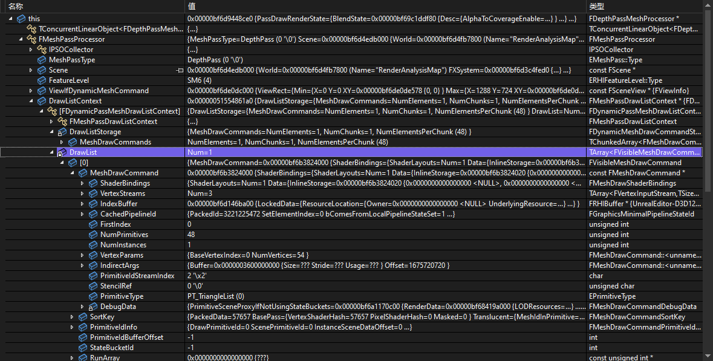

#### 生成RHICommand
在`RenderPrePass`的入口打断点发现在进行`PrePass`的`RHICommand`生成前`RHICommandList`中共有95个`RHICommand`。
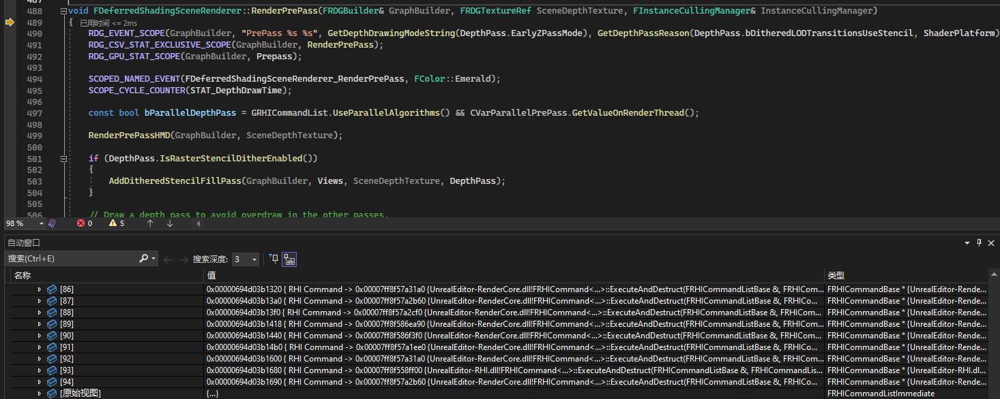
与RDG的`Passes`列表对照，可以发现这些`RHICommand`是在`RenderPrePass`之前加入RDG的`Pass`生成的。

截取最后的几个`RHICommand`为例子，`FRHICommandBeginRenderPass`中有该`RenderPass`的`Info`和`Name`等信息，对照可以发现这几条`RHICommand`是RDG的`Passes`列表末尾的`Scene.ClearDepthStencil`生成的。
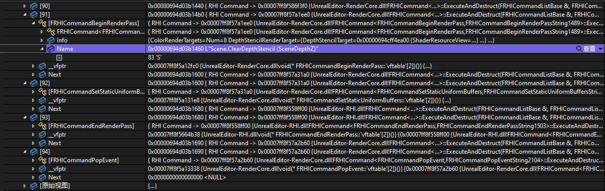
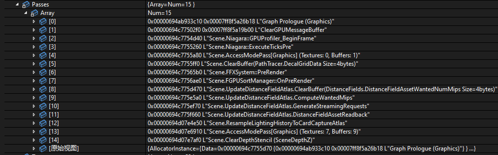

在`PrePass`被加入`GraphBuilder`(RDG)之前，会先执行`FParallelMeshDrawCommandPass::BuildRenderingCommands`生成多条`RHICommand`，这些`RHICommand`主要用于在GPU上使用ComputeShader进行`InstanceCulling`剔除相关的计算，遮挡剔除完成后会得到可见的`InstanceIds`存储在`UniformBuffer`中。

在`BuildRenderingCommands`完成后`RHICommandList`中共有131个`RHICommand`。
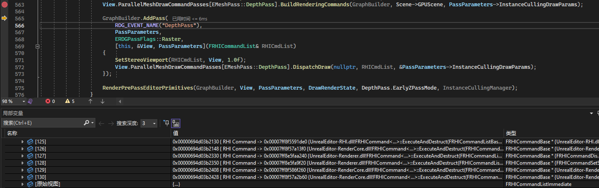

在`PrePass`被加入`GraphBuilder`后，会进行一系列的资源的处理，到执行`DisPatchDraw`中`SubmitDrawCommands`之前，`RHICommandList`中又生成了8条`RHICommand`命令，这些命令分别是

[131] pop之前的event

[132] 设置Breadcrumb（面包屑）调试信息，具体为`PrePass DDM_ALLOpaque(Forced by Nanite)`

[133] push当前的event，具体为`DepthPass`

[134] [135] 资源转变命令

[136] BeginRenderPass

[137] 设置StaticUniformBuffer (`RHICmdList.SetStaticUniformBuffers(ParameterStruct.GetStaticUniformBuffers());`)

[138] 设置ViewPort (`SetStereoViewport(RHICmdList, View, 1.0f);`)

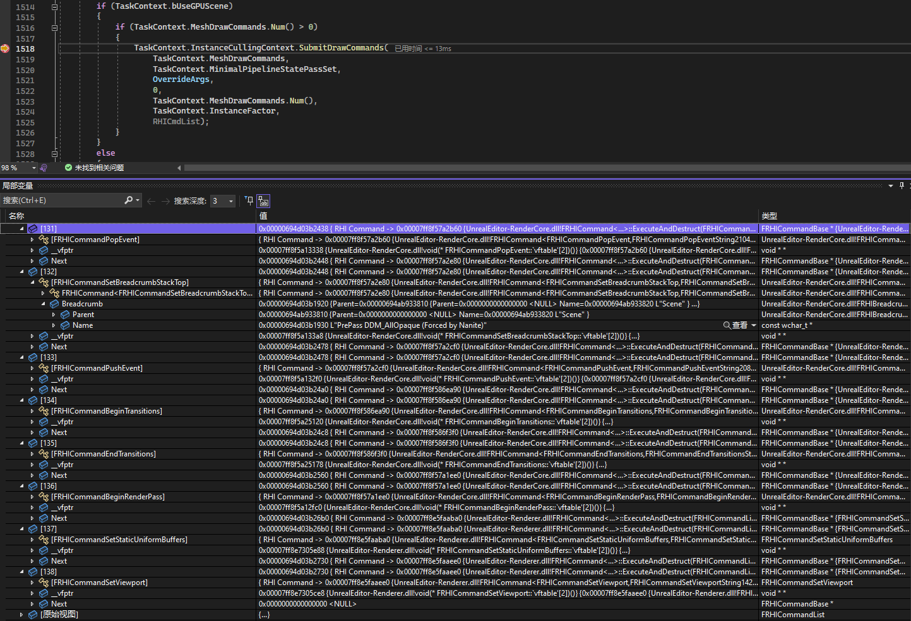

接着，在`FMeshDrawCommand::SubmitDraw`中会调用`FMeshDrawCommand::SubmitDrawBegin`将`FMeshDrawCommand`的信息转为`RHICommand`并添加到`RHICommandList`，然后调用`FMeshDrawCommand::SubmitDrawEnd`创建绘制相关的`RHICommand`。此时的调用堆栈如下。
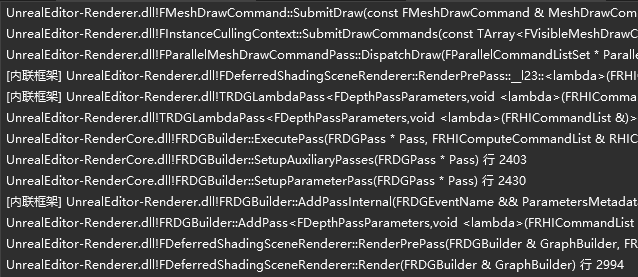
注： [139][140] 是`FMeshDrawCommand::SubmitDraw`中设置的两条 Breadcrumb（面包屑）调试信息，分别输出了`MaterialName`和`PrePass DDM_ALLOpaque(Forced by Nanite)`


```cpp
// Engine\Source\Runtime\Renderer\Private\MeshPassProcessor.cpp
bool FMeshDrawCommand::SubmitDrawBegin(
	const FMeshDrawCommand& RESTRICT MeshDrawCommand, 
	const FGraphicsMinimalPipelineStateSet& GraphicsMinimalPipelineStateSet,
	FRHIBuffer* ScenePrimitiveIdsBuffer,
	int32 PrimitiveIdOffset,
	uint32 InstanceFactor,
	FRHICommandList& RHICmdList,
	FMeshDrawCommandStateCache& RESTRICT StateCache,
	bool bAllowSkipDrawCommand)
{
	...
	// 生成RHICommand: FRHICommandSetGraphicsPipelineState
	SetGraphicsPipelineState(RHICmdList, GraphicsPSOInit, MeshDrawCommand.StencilRef, EApplyRendertargetOption::CheckApply, bApplyAdditionalState, PSOPrecacheResult);
	...
	// 生成RHICommand: FRHICommandSetStreamSource
	RHICmdList.SetStreamSource(Stream.StreamIndex, Stream.VertexBuffer, Stream.Offset);
	...
	// 生成RHICommand: FRHICommandSetShaderParameters<FRHIGraphicsShader>
	MeshDrawCommand.ShaderBindings.SetOnCommandList(RHICmdList, MeshPipelineState.BoundShaderState.AsBoundShaderState(), StateCache.ShaderBindings);
	...
}
```
在`FMeshDrawCommand::SubmitDrawBegin`中打断点分析，可以发现在`RHICommandList`的末尾新生成了5条`RHICommand`，按顺序分别是1条`FRHICommandSetGraphicsPipelineState`，3条`FRHICommandSetStreamSource`和1条`FRHICommandSetShaderParameters<FRHIGraphicsShader>`
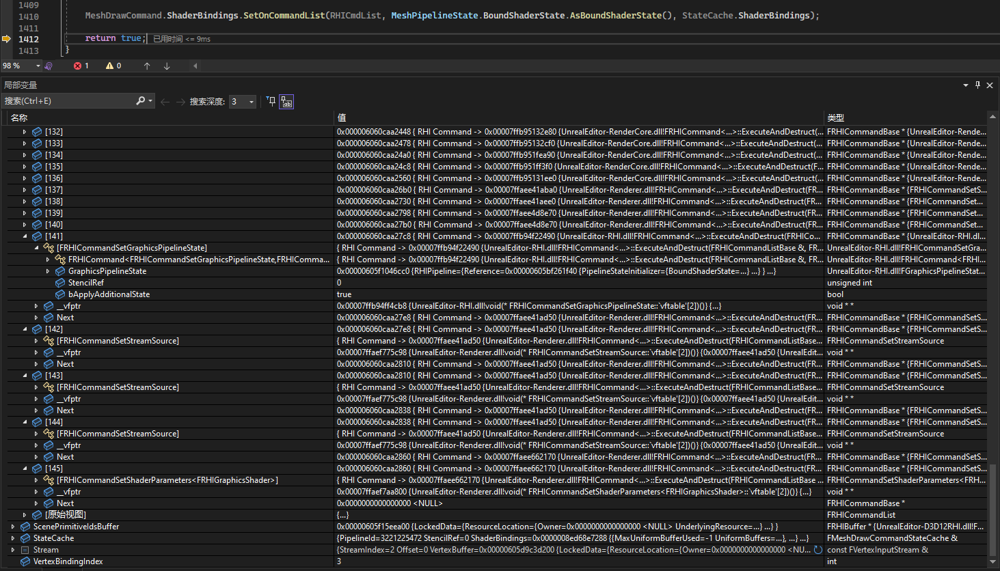

在`FMeshDrawCommand::SubmitDrawEnd`中打断点分析，可以发现在`RHICommandList`的末尾新生成了1条`RHICommand`，它就是对应着绘制指令的`FRHICommandDrawIndexedPrimitive`，可以看到其参数与前文的Cube几何参数对应。
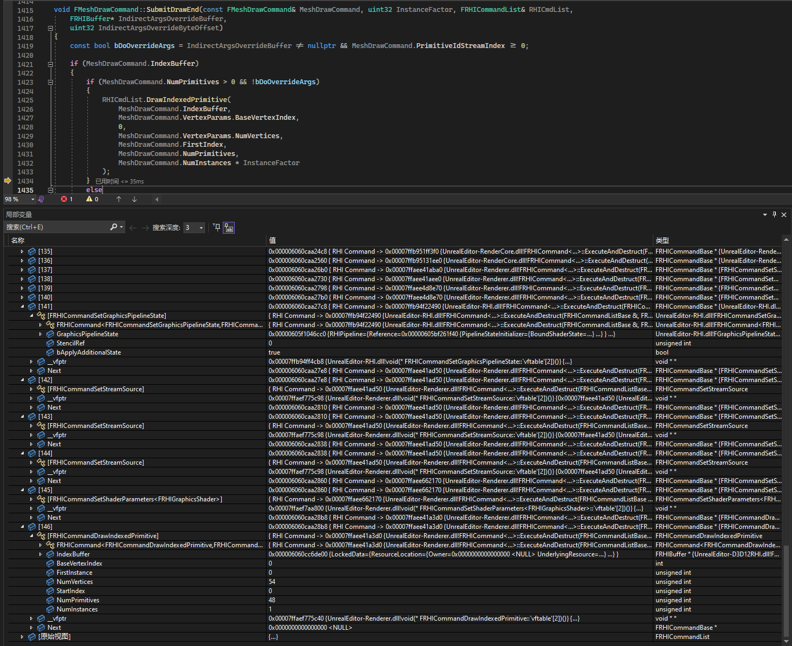

在执行完作为Lambda传入RDG的`DisPatchDraw`后，渲染逻辑又回到了RDG中，在RDG中进行最后的处理，生成了两条结束用的`RHICommand`:

[147] EndRenderPass

[148] PopEvent

此时渲染逻辑回到`RenderPrePass`中，`RenderPrePassEditorPrimitives`函数生成了最后的6条`RHICommand`用于绘制编辑器图元。
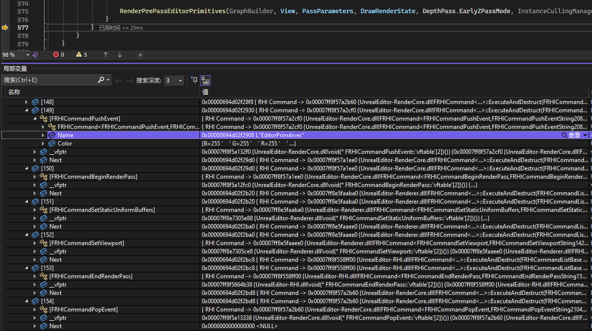

此时PrePass的所有绘制命令已经收集完毕，最终对应着的是以上`RHICommandList`中从95到154共计60条`RHICommand`。

关于PrePass的分析到此结束，从物体本身的几何信息，加入场景时缓存的`FMeshBatch`，生成对应于`FMeshBatch`的`MeshDrawCommand`，再到最后使用`MeshDrawCommand`中的信息构建`RHICommand`并加入`RHICommandList`，每一个阶段都和上一个阶段的数据互相对应，环环相扣。以此为参考，管中窥豹，可作为复杂的网格绘制管线的分析的起点。

---

## The Entire Scene
### All MeshDrawCommands
`FParallelMeshDrawCommandPass::DispatchPassSetup`时会将该Pass中三种不同路径来源的`FMeshDrawCommand`收集完毕，这三个路径分别是

1. DynamicMesh
   
2. 静态绘制路径缓存了`FMeshBatch`但是需要动态构建`MeshDrawCommand`的StaticMesh

3. 静态绘制路径缓存的`MeshDrawCommand`
   
依次对应于图上的三种。
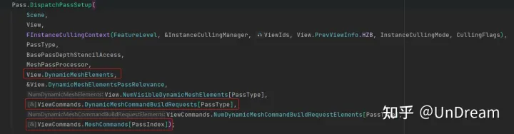

在`FSceneRenderer::SetupMeshPass`之后可以看到所有Pass收集到的`MeshDrawCommand`。总共有三个Pass有`MeshDrawCommand`，分别是`PrePass`，`BasePass`，`HitProxy`，每个Pass都只有一个`MeshDrawCommand`，因此场景里总共有三个`MeshDrawCommand`，这些`FMeshDrawCommand`会在渲染对应Pass时产生一系列`RHICommand`。
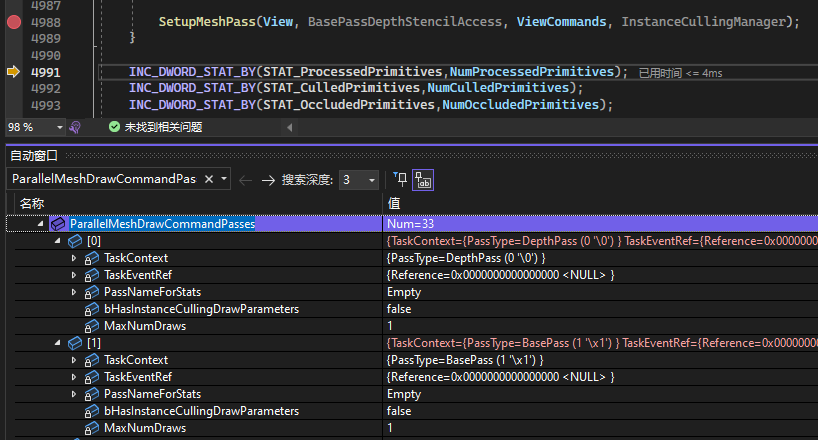
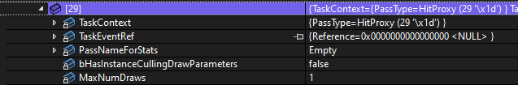

### All RHICommands
前文中提到，在`FDeferredShadingSceneRenderer::Render`中，有许多的`RenderXXXPass()`函数会执行对应于`EMeshPass::Type`定义的33个Pass的渲染，这些渲染函数会产生一系列的`RHICommand`。实际上，除了这些函数之外，还有许多别的函数也会产生`RHICommand`。33个Pass产生的`MeshDrawCommand`可以对应到一系列的`RHICommand`，但是并非所有的`RHICommand`都是由`MeshDrawCommand`生成而来，各种在GPU上的计算如光照计算，遮挡剔除等等，都会产生一系列的`RHICommand`。

分析`RHICommand`的来源可以从被添加到RDG的`Pass`入手，在`RenderBasePass`之前打断点查看`GraphBuilder`信息可以发现，此时已有733条`RHICommand`和89个RDGPass。
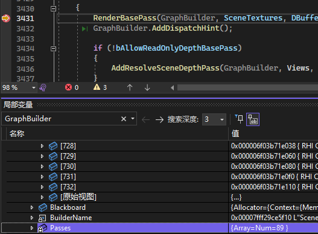

其中既有`Scene.BuildHZB(ViewId=0)`和`Scene.ComputeLightGrid.CullLights`这样的在GPU上的遮挡剔除相关的计算，也有之前分析过的`PrePass`相关的绘制。
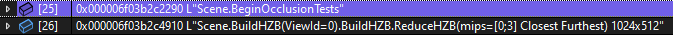

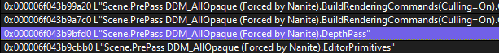

最后整个场景生成了2148条`RHICommand`。
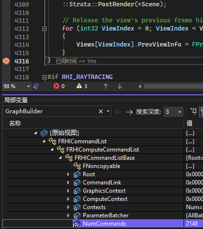

---


## Footnotes
#### FMeshBatchElement
FMeshBatchElement里面储存了单个网格所需的数据，如IndexBuffer，shaderParameters等
#### FMeshBatch
FMeshBatch包含了一个pass的所需要的全部渲染数据，它会维护一个FMeshBatchElement列表，FMeshBatchElement包含了单个网格绘制所需的数据，包括UniformBuffer、IndexBuffer等等。事实上，最后一个FMeshBatchElement就对应了一次DrawCall.

FMeshBatch解耦了Pass和FPrimitiveSceneProxy，包含了绘制pass所需信息。

拥有一组FmeshBatchElement（但绝大多数情况下只用一个，除了FInstancedStaticMeshSceneProxy和FHierarchicalStaticMeshSceneProxy中的接口会对数组作填充，其余情况都只用到一个FMeshBatchElement），他们共享相同材质的vertexFactory

#### FMeshElementCollector
FMeshElementCollector 由 FSceneRenderer 创建且一一对应。

收集器收集完对应view的可见图元列表后，通常拥有一组需要渲染的FMeshBatch列表，以及它们的管理数据和状态，为后续的流程收集和准备足够的准备。

此外，FMeshElementCollector在收集完网格数据后，还可以指定需要等待处理的任务列表，以实现多线程并行处理的同步。

#### GetDynamicMeshElements() & GetDynamicElementsSection()
```cpp
void FSceneRenderer::GatherDynamicMeshElements(){
    PrimitiveSceneInfo->Proxy->GetDynamicMeshElements();
}
```
是给每个图元对象向渲染器（收集器）添加可见图元元素的机会，由具体的子类实现，如 FSkeletalMeshSceneProxy，FSkeletalMeshSceneProxy会根据不同的LOD索引，给每个Section网格添加一个FMeshBatch。

#### ParallelMeshDrawCommandPasses
```cpp
void FParallelMeshDrawCommandPass::DispatchPassSetup()
{
    ... 先收集 TaskContext 信息 ...
    FMeshDrawCommandPassSetupTask::AnyThreadTask() 使用 TaskContext 信息生成绘制指令、写入数据
    FMeshDrawCommandInitResourcesTask::AnyThreadTask() 使用 TaskContext 信息初始化绘制资源
}
```
#### FMeshDrawCommandPassSetupTaskContext
收集FMeshDrawCommandPassSetupTask需要的信息
#### FMeshDrawCommandPassSetupTask
在FMeshDrawCommandPassSetupTask中进行绘制指令生成与相关数据的写入
#### FMeshPassProcessor & AddMeshBatch() & TryAddMeshBatch() & BuildMeshDrawCommands() & FMeshPassDrawListContext
每个Pass都对应了一个FMeshPassProcessor，每个FMeshPassProcessor保存了该Pass需要绘制的所有FMeshDrawCommand，以便渲染器在合适的时间触发并渲染。

不同Pass的通过调用AddMeshBatch()方法处理FMeshBatch中的几何信息，主要的处理在TryAddMeshBatch()中，该方法中进行了shader绑定，渲染转台处理等，最后根据不同的选项和质量选择不同的Process使用BuildMeshDrawCommands()将FMeshBatch转为FMeshDrawCommand。

生成的FMeshDrawCommand被保存在FMeshPassDrawListContext中。
> 官方文档中对 FMeshPassProcessor 的解释：
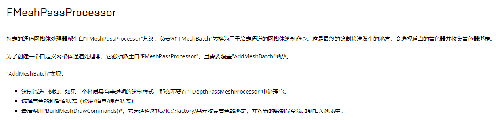
#### GenerateDynamicMeshDrawCommands()
转换指定EMeshPass中的每个FMeshBatch到一组FMeshDrawCommand。FMeshDrawCommandPassSetupTask要用到。
```cpp
void GenerateDynamicMeshDrawCommands(){
    PassMeshProcessor->AddMeshBatch();
}
``` 
#### FMeshDrawCommand
内有资源绑定信息如着色器绑定(ShaderBindings)、顶点流(VertexStreams)、索引缓冲(IndexBuffer)、PSO管线ID(CachedPipelineId)、绘制参数(FirstIndex、NumPrimitive、NumInstances)等。
> FMeshDrawCommand（网格绘制指令），记录了绘制单个Mesh所需的所有资源和数据，且不应该有多余的数据，如果需要在InitView传递数据，可用FVisibleMeshDrawCommand。
#### FParallelMeshDrawCommandPass & DispatchPassSetup() & DispatchDraw()
Encapsulates two parallel tasks - mesh command setup task and drawing task

DispatchPassSetup() 对应 mesh command setup task 

DispatchDraw() 对应 drawing task

同时保存着该pass的meshdrawcommand

#### RHICommand
RHI全称Rendering Hardware Interface（渲染硬件接口），是不同图形API的抽象层，而RHICommandList便是负责收录与图形API无关的中间层绘制指令和数据。
#### RHICommandList
RHICommandList收录了一系列中间绘制指令之后，会在RHI线程一一转换到对应目标图形API的接口
#### RDG
RDG全称是Rendering Dependency Graph，意为渲染依赖性图表，是UE4.22开始引进的全新的渲染子系统，基于有向无环图(Directed Acyclic Graph，DAG)的调度系统，用于执行渲染管线的整帧优化。UE中使用RDG代替原本直接调用RHI命令的方式，由RDG调整资源的生命周期，裁剪Pass，处理Pass的资源转换和屏障，处理异步计算Pass的依赖和引用关系，查找并建立分叉和合并Pass节点，合并所有具体相同渲染目标的光栅化Pass等。
#### FRDGPass
RDGPass和渲染Pass并非一一对应关系，有可能多个RDGPass合并成一个渲染Pass。

---
## Reference
0. [虚幻引擎网格体绘制管道 | 虚幻引擎5.2文档](https://docs.unrealengine.com/5.2/zh-CN/mesh-drawing-pipeline-in-unreal-engine/)
0. [剖析虚幻渲染体系（03）- 渲染机制 - 0向往0 - 博客园](https://www.cnblogs.com/timlly/p/14588598.html#322-%E4%BB%8Efprimitivesceneproxy%E5%88%B0fmeshbatch)
0. [UE5【理论】1.网格绘制管线MeshDrawPipeline](https://zhuanlan.zhihu.com/p/574116410)
0. [虚幻4渲染编程(Shader篇)【第十二卷：MeshDrawPipline】](https://zhuanlan.zhihu.com/p/61464613)
0. [UE5渲染前数据准备 - 知乎](https://www.zhihu.com/column/c_1623021177307365376)
